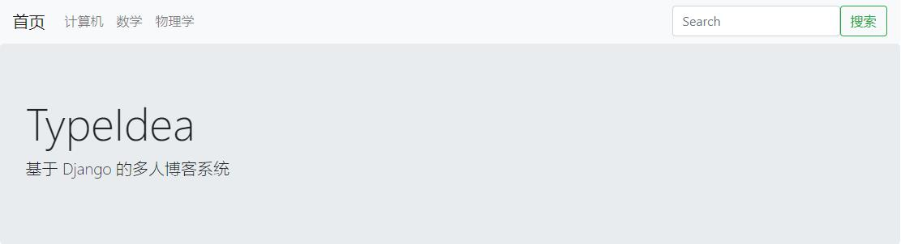

# TypeIdea
A blog system implemented by [Django](https://www.djangoproject.com/) (deployed on Windows).



## Environment Setup
1. Install [Python3.6](https://www.python.org/downloads/release/python-360/).

2. Change directory to your project folder (e.g `D:\TypeIdea`), then create virtual environment (e.g. `virtualenv -p D:\python-3.6.0-embed-amd64\python.exe venv`). If the `virtualenv` package doesn't exist, install it using `pip install virtualenv`.

3. Activate virtualenv: 
   ```
   .\venv\Scripts\activate.ps1
   ```

4. Install Django and other packages: 
   ```
   pip install -r requirements.txt
   ```

5. Create database and tables: 
   ```shell
   python manage.py makemigrations
   python manage.py migrate
   ```
6. Create admin account: 
   ```shell
   python manage.py createsuperuser
   ```

7. Use dbshell for SQLite (optional): 
   1. Download `sqlite-tools-win32-x86-*******.zip` on [SQLite Download Page](https://www.sqlite.org/download.html).
   2. Unpack it and just paste it to the folder where you have your `manage.py`. You can paste all 3 files there (`sqldiff.exe`, `sqlite3.exe`, `sqlite3_analyzer.exe`).
   3. Then: 
       ```shell
       python manage.py dbshell
       sqlite> .tables
       ...
       sqlite> .exit
       ```

## Run Server
```shell
python manage.py runserver
```
Then access browser: 
```
# home page
localhost:8000

# admin pages
localhost:8000/super_admin
localhost:8000/admin
```

## P.S.
- With PyCharm, you need to reset the `Content Root` to the subdirectory `typeidea`, otherwise an editor resource reference error will occur.

## References
https://github.com/the5fire/typeidea
